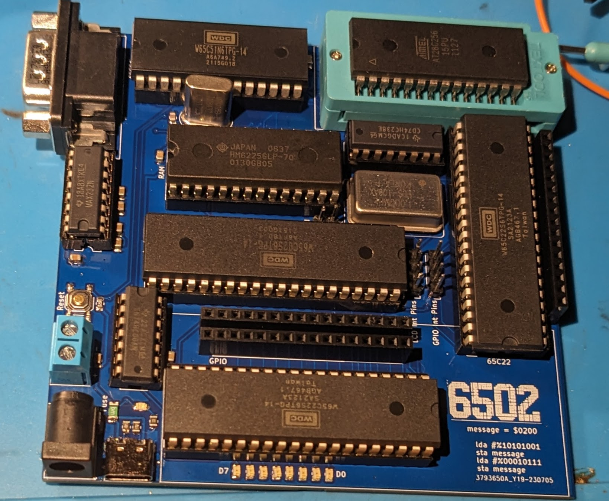

# 6502v2 Computer Build

Please note while this design is based on Ben Eaters 6502 (eater.net/6502) computer, it is not 100% compatible. This is mostly due to the memory map being changed to make space for 3 interface chips, 2 c22s and a c51. 

Memory Map:
  0x0000 -> 0x3FFF : RAM
  0x4010 : Start of memory for the "GPIO" VIA
  0x4020 : Start of memory for the "LCD" VIA
  0x4040 : Start of memory for the Serial interface
  0x8000 -> 0xFFFF : ROM

It is very simple to refactor any code written for the BE6502 to work with this design, all you have to do is change the definitions for the different ports, ex PORTB = $6020 would be PORTB = $4020.  

#Pictures

 
The LCD header was mirrored on this first run of boards, the GERBER files and KiCad project have been updated in the repo. 
